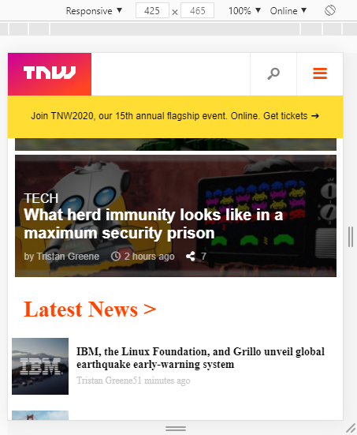
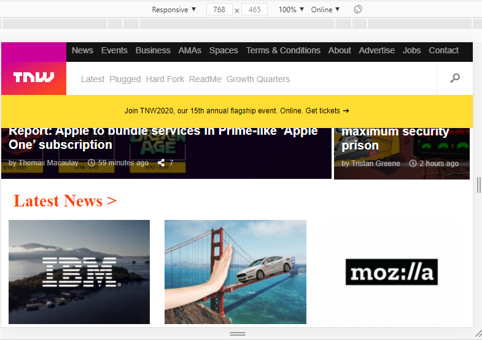
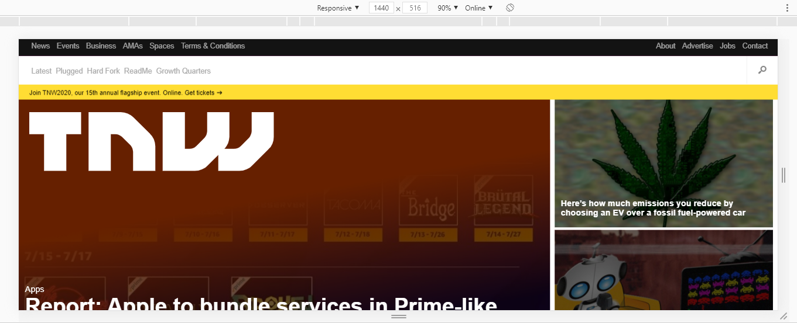

# TNW
The project consists of creating a responsive website of The Next Web that changes the position and size of the items and images using media query to resize the items.

## Built With

- [HTML](https://developer.mozilla.org/en-US/docs/Web/HTML),
- [CSS](https://www.w3schools.com/css/),
- [Fontawesome](https://fontawesome.com/),
- [googlefonts](https://fonts.google.com/),

## Live Demo

[Live Demo Link](https://rawcdn.githack.com/BrianSammit/TNW/e576cd56dd58f8b8cb904cb9729af224e2c9c78d/index.html)

## Authors

👤 Brian Sammit Cruz Rodriguez

Github: @BrianSammit https://github.com/BrianSammit

Twitter: @CruzSammit https://twitter.com/CruzSammit

Linkedin: https://www.linkedin.com/in/brian-sammit-cruz-rodriguez-5877551a8/

👤 Ssegawa Alvin Louis K

Github: https://github.com/alvinlouis29

Twitter: https://twitter.com/louisssegawa

## 🤝 Contributing

Contributions, issues and feature requests are welcome!

## Show your support

Give a ⭐️ if you like this project!

## Acknowledgments

- Microverse
- W3schools
- Freecodecamp
- Developer.mozilla
- Learnshayhowe
- Odin project

## 📝 License

NO license: This project is free for anyone to use.
